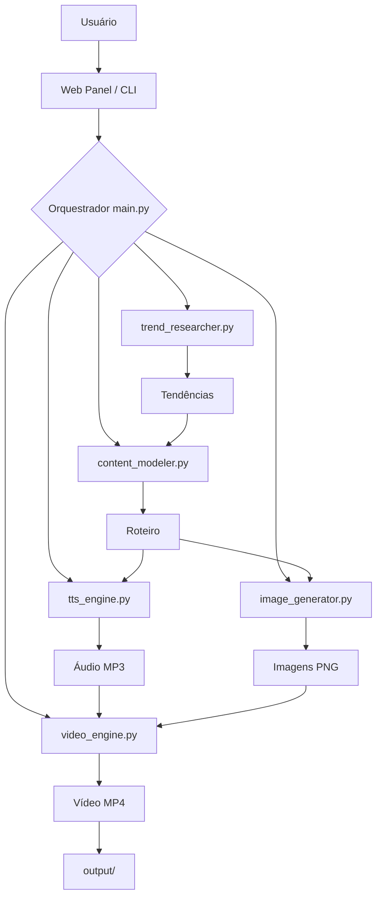

# Viral Bot - Arquitetura Técnica

## Diagrama de Fluxo

## Camadas (AGENTS.md)

| Camada | Responsabilidade | Arquivos |
|--------|-----------------|----------|
| **L1: Directives** | SOPs, instruções | `directives/*.md` |
| **L2: Orchestration** | Decisões, fluxo | `src/main.py`, `src/web_panel.py` |
| **L3: Execution** | Trabalho determinístico | `execution/*.py` |

## Módulos

| Módulo | Função |
|--------|--------|
| `trend_researcher.py` | Busca tendências |
| `content_modeler.py` | Gera roteiros |
| `tts_engine.py` | Gera áudio |
| `image_generator.py` | Gera imagens |
| `video_engine.py` | Monta vídeo |
| `web_panel.py` | Interface web |
